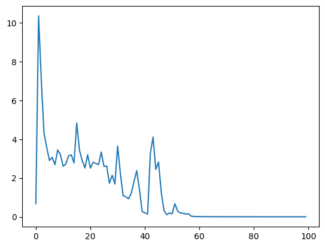
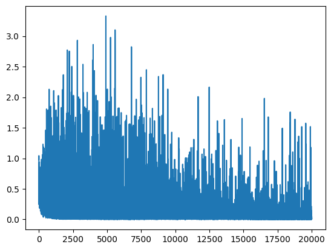

# Analisys of imdb comments by using AI

## 1. Completing the incomplete parts of the neural network

### 1. Some utilities and dataset for Part 2

for the first part my code does:

1. Importing the necessary libraries:

   - numpy for numerical computations
   - matplotlib.pyplot for plotting
   - make_moons from sklearn.datasets to generate a synthetic dataset with two interleaving half circles.
2. Generating and plotting the data:

   - The `make_moons` function is used to generate a synthetic dataset with 2000 samples and some level of noise.
   - The `plot_data` function is defined to plot the generated data points.
3. Setting up the plot and displaying the data:

   - x_min, x_max, y_min, y_max are defined to set the limits of the plot.
   - A figure and axes are created using `plt.subplots`.
   - The plot limits are set using `ax.set_xlim` and `ax.set_ylim`.
   - The `plot_data` function is called to plot the generated data points.
   - Finally, `plt.show` is called to display the plot.
4. Defining the neural network layers:

   - Three layer classes are defined: `Linear`, `ReLU`, and `Sigmoid`.
   - `Linear` represents a linear layer with weights and biases. It has methods for forward pass, backward pass (computing gradients), and weight updates (step method).
   - `ReLU` represents the rectified linear unit activation function. It has methods for forward pass and backward pass, but the step method doesn't do anything.
   - `Sigmoid` represents the sigmoid activation function. It has methods for forward pass and backward pass, but the step method doesn't do anything.
5. Defining the model:

   - The `Sequential` class represents the neural network model. It takes any number of layer objects as arguments.
   - The class has methods for forward pass, backward pass, weight updates, and training.
   - The forward method applies the forward pass sequentially through the layers.
   - The backward method applies the backward pass (backpropagation) sequentially through the layers.
   - The step method updates the weights and biases sequentially through the layers.
   - The train method trains the model by iterating over the specified number of epochs. It calculates the loss, performs backpropagation, and updates the weights and biases.
6. Instantiating the model:

   - An instance of the `Sequential` class is created and initialized with the layers: `Linear(2, 64)`, `ReLU()`, `Linear(64, 1)`, and `Sigmoid()`.
7. Reshaping the target variable:

   - The target variable `Y` is reshaped to be a 2D array. This is required for compatibility with the model during training.
8. Training the model:

   - The `train` method of the model is called with the input features `X`, target `Y`, number of epochs, and learning rate. It trains the model, computes the loss for each epoch, performs backpropagation, and updates the weights and biases.
9. Plotting the loss history:

   - The loss values stored in the `history` list are plotted using `plt.plot` to visualize the training progress over epochs. The loss values represent the decrease in loss over the training process.

The **Result**:


```
Epoch 1/100, Loss: 0.6796521716940078
Epoch 2/100, Loss: 10.355442366663532
Epoch 3/100, Loss: 7.046582489932066
Epoch 4/100, Loss: 4.2933642666815475
Epoch 5/100, Loss: 3.5678390888806106
Epoch 6/100, Loss: 2.8997185596081763
Epoch 7/100, Loss: 3.0658460014994473
Epoch 8/100, Loss: 2.6852947187844327
Epoch 9/100, Loss: 3.4443730419279777
Epoch 10/100, Loss: 3.2125750490332012
Epoch 11/100, Loss: 2.6047703412725594
Epoch 12/100, Loss: 2.7230004503119902
Epoch 13/100, Loss: 3.1420594364300687
Epoch 14/100, Loss: 3.1921920754180504
Epoch 15/100, Loss: 2.775890485209574
Epoch 16/100, Loss: 4.833194196662208
Epoch 17/100, Loss: 3.4226327387814703
Epoch 18/100, Loss: 2.9025788494440787
Epoch 19/100, Loss: 2.517889355931653
Epoch 20/100, Loss: 3.1961797600243287
Epoch 21/100, Loss: 2.509808125230894
Epoch 22/100, Loss: 2.806564325620446
Epoch 23/100, Loss: 2.752606498117768
Epoch 24/100, Loss: 2.686527545263174
Epoch 25/100, Loss: 3.335884297252371...

Epoch 97/100, Loss: 0.002273292765219811
Epoch 98/100, Loss: 0.002239258591005477
Epoch 99/100, Loss: 0.002206668995733403
Epoch 100/100, Loss: 0.002175275437748777
```



The Y-axis of the graph represents the value of the loss function, and the X-axis represents the number of epochs, which is the number of times the entire dataset is passed forward and backward through the neural network.

Initially, at epoch 0, the model is just initialized with random weights, and it's likely not providing very accurate predictions, so the loss is high (10 in this case). As the model starts learning from the data, the loss starts to decrease, which means the model's predictions are getting closer to the actual values.

By epoch 100, the loss has decreased to near zero, suggesting that the model's predictions are very close to the actual values.

## 2. review and pre-processing of textual data

In this part, we went to the implementation of the second part.
What we did in this section:

1. Define the ReLU and Sigmoid layers:

   - `MyReLU` class implements the ReLU activation function. It has methods for forward pass (ReLU operation) and backward pass (gradient computation).
   - `MySigmoid` class implements the sigmoid activation function. It has methods for forward pass (sigmoid operation) and backward pass (gradient computation).
2. Define the Linear layer:

   - `MyLinear` class represents a linear layer with weights and biases. It has methods for forward pass (matrix multiplication with weights and addition of biases) and backward pass (gradient computation).
3. Define the Sequential model:

   - `Sequential` class represents the neural network model. It takes a list of layers as input.
   - It has methods for forward pass, loss computation, backward pass, and weight updates.
4. Instantiate the model and define the architecture:

   - An instance of the `Sequential` class is created with the specified layers (Linear, ReLU, Linear, Sigmoid).
5. Define the training loop:

   - Set the learning rate, number of epochs, and create an empty list to store the losses.
   - Iterate over the specified number of epochs.
   - For each epoch, iterate over the data points (x, y) in the dataset.
   - Perform a forward pass, compute the loss, store the loss in the list.
   - Perform backward pass, update the weights and biases using the learning rate.
6. Plot the loss values:

   - Plot the loss values stored in the list using matplotlib.
7. Plot the decision boundary:

   - This part of the code is missing (`plot_decision_boundary` is not defined), so it cannot be explained without additional context.

### **The Result:**




We can see that according to the prediction, we managed to divide the crescent-shaped data into two categories.

### Answers to the questions asked:

1. **Text Preprocessing:** Text data is unstructured and can't be used directly for machine learning models. So, it needs to be preprocessed and transformed into a structured format. Here, the TF-IDF (Term Frequency-Inverse Document Frequency) method is used. TF-IDF is a statistical measure that evaluates how relevant a word is to a document in a collection of documents. This is done by multiplying two metrics: how many times a word appears in a document, and the inverse document frequency of the word across a set of documents. It has many uses, most importantly in automated text analysis, and is very useful for scoring words in machine learning algorithms for Natural Language Processing (NLP).

   The `TfidfVectorizer` from the `sklearn.feature_extraction.text` library is used to transform the text data into its TF-IDF representation. The `max_features` parameter is set between 3000 and 7000, which means that the vectorizer will only consider the top `max_features` ordered by term frequency across the corpus.
2. **Normalization:** Normalization of text data is an important step that ensures that the text data is represented in a consistent manner. This can include tasks such as converting all text to lower case, removing punctuation, converting numbers into their word equivalents, removing stop words (common words that don't carry much information), etc. You are also advised to convert words to their roots (stemming) or to their base forms (lemmatization).
3. **Encoding Label:** The sentiment column data must be converted to numerical data. This is necessary because machine learning models work with numerical data. This can be done using label encoding, which involves converting each value in a column to a number.

After preprocessing the text data, a neural network is trained on this data. The provided code defines classes for different types of layers (Linear, ReLU, Sigmoid), a Sequential class for a model composed of these layers, and a training loop. You are required to fill in the methods in these classes with the appropriate code.

1. **Stemming and Lemmatization:** Both stemming and lemmatization are used to reduce inflectional forms of a word to a common base form. Stemming usually refers to a crude heuristic process that chops off the ends of words in the hope of achieving this goal correctly most of the time. On the other hand, lemmatization usually refers to doing things properly with the use of a vocabulary and morphological analysis of words, normally aiming to remove inflectional endings only and to return the base or dictionary form of a word, which is known as the lemma.
2. **Checking and displaying a random positive and negative comment in the train dataset:** This involves randomly selecting a positive and a negative comment from the train dataset and displaying them. This can be done using the `random` library in Python.
3. **Calculating the number of comments in each category for the train and test datasets and drawing a bar graph for them:** This involves calculating the number of positive and negative comments in the train and test datasets and plotting these numbers in a bar graph. This can be done using the `matplotlib` library in Python.
4. **Checking that the value of each feature is between 0 and 1 before giving input to the neural network:** Normalizing the input features to be in the range [0, 1] is generally good practice. This is because most common activation functions of the network's neurons such as tanh or sigmoid are defined on
5. **TF-IDF:** TF-IDF stands for Term Frequency-Inverse Document Frequency. It's a numerical statistic that reflects how important a word is to a document in a corpus. It works by increasing proportionally to the number of times a word appears in the document, but is offset by the number of documents in the corpus that contain the word. This helps to adjust for the fact that some words appear more frequently in general. The `TfidfVectorizer` class in sklearn converts a collection of raw documents to a matrix of TF-IDF features. It's equivalent to `CountVectorizer` followed by `TfidfTransformer`.

   The `max_features` argument is used to limit the number of features (vocabulary size). Only the top `max_features` ordered by term frequency across the corpus will be kept. If set between 3000 and 7000, it will keep the top 3000-7000 most frequent terms.
6. **Text Preprocessing:** This often includes steps like:

   * **Removing frequent words or stop words:** These are words that don't contain important meaning and are usually removed from texts. They include words like "is", "at", "which", and "on".
   * **Removing meaningless expressions:** These are usually HTML tags or other markup that is not useful for understanding the sentiment of a text.
   * **Removing unimportant characters:** This can include punctuation, special characters, or escape characters like `\n` and `\r`.
   * **Stemming and Lemmatization:** Both are processes of reducing inflected (or sometimes derived) words to their root form. Stemming is a little more aggressive. It chops off the ends of words based on common prefixes and suffixes, which can sometimes result in words that are not actual words. Lemmatization is more conservative and only reduces words to their base form (called a lemma) when it can be determined with the use of a vocabulary and morphological analysis of words. This means that it is generally more accurate, but is also slower.
   * **Converting text to lower case:** This can help to ensure that the same word in different cases is recognized as the same word.
7. **Label Encoding:** The sentiment column data must be converted to numerical data. You can use label encoding for this. Label encoding involves assigning each unique value in a column to a number. For example, you might encode "Positive" as 1 and "Negative" as 0.
8. **Training and Test Data:** It's important to apply the same preprocessing steps to both the training and test data. This is because the model learns from the training data, and then is tested on the test data. If the test data is in a different format or uses different conventions, then the model may not perform well.

## 3. Using PyTorch

### 3.1. Learn Network:

In this part I do following task:

1. Importing the necessary libraries:

   - `TfidfVectorizer` from `sklearn.feature_extraction.text` for vectorizing the text data.
   - `train_test_split` from `sklearn.model_selection` for splitting the data into train and test sets.
   - Various evaluation metrics from `sklearn.metrics` for evaluating the performance of the model.
   - `torch` and `torch.nn` for building and training the neural network model.
   - `torch.optim` for the optimization algorithm.
   - `TensorDataset` and `DataLoader` from `torch.utils.data` for creating data loaders.
2. Reading the dataset:

   - The code reads a dataset from a CSV file called `imdb_dataset.csv` using pandas and assigns it to `imdb_data`.
3. Preprocessing the data:

   - The reviews text is vectorized using `TfidfVectorizer` with a limit of 5000 features. The vectorized text is stored in `X`.
   - The sentiment labels are converted to binary integers (0 for negative, 1 for positive) and stored in `y`.
4. Splitting the data into train and test sets:

   - The data is split into training and testing sets using `train_test_split` from scikit-learn. The test size is set to 0.2 (20% of the data), and a random state of 42 is used for reproducibility.
5. Converting the training data to PyTorch tensors:

   - The training features (`X_train`) and labels (`y_train`) are converted to PyTorch tensors (`X_train_tensor` and `y_train_tensor`) using `torch.from_numpy` and `float()`.
6. Creating a DataLoader:

   - The training data is converted into a `TensorDataset`, and a `DataLoader` is created to handle batching with a batch size of 16.
7. Defining the network architecture:

   - The neural network architecture is defined in the `Net` class. It consists of three fully connected (linear) layers with ReLU activation between the first two layers and sigmoid activation in the final layer.
8. Creating the network:

   - An instance of the `Net` class is created and assigned to the variable `net`.
9. Defining the loss function and optimizer:

   - Binary Cross Entropy Loss (`BCELoss`) is used as the loss function.
   - Stochastic Gradient Descent (`SGD`) is used as the optimizer, which optimizes the parameters of the network (`net.parameters()`) with a learning rate of 0.01.
10. Training the network:

    - The network is trained for 10 epochs with a nested loop over the batches in the data loader.
    - For each batch, the inputs and labels are obtained.
    - The gradients are zeroed with `optimizer.zero_grad()`.
    - The forward pass is performed, the loss is computed, and the backward pass is executed.
    - The optimizer is used to update the network's parameters.
    - Running loss is calculated and printed every 2000 mini-batches.
11. Testing the network and evaluating performance:

    - The testing data is converted to PyTorch tensors (`X_test_tensor` and `y_test_tensor`).
    - Predictions are made on the training and testing data using the trained network.
    - The predicted probabilities are converted to binary predictions based on a threshold of 0.5.
    - Classification metrics including accuracy, recall, precision, and F1-score are calculated and printed using the predicted and true labels for both training and testing sets.

**Result:**

```
[1,  2000] loss: 0.693
[2,  2000] loss: 0.693
[3,  2000] loss: 0.692
[4,  2000] loss: 0.691
[5,  2000] loss: 0.686
[6,  2000] loss: 0.668
[7,  2000] loss: 0.573
[8,  2000] loss: 0.392
[9,  2000] loss: 0.306
[10,  2000] loss: 0.271
Finished Training

Train Accuracy: 0.903925
Test Accuracy: 0.8925
Train Recall: 0.9145333400130254
Test Recall: 0.9059337170073427
Train Precision: 0.8952040015692428
Test Precision: 0.883662408052652
Train F1: 0.904765444948331
Test F1: 0.8946594806467417
```

### 3.2. Network weighting

**Question:** If the initial value of all network weights was zero and you trained the network, what would be the results? (no need to implement)?

**Answer**: Initializing all weights to zero in a neural network is generally not a good idea. Here's why:

1. Symmetry problem: The issue arises from the fact that each neuron in the network will learn the same features during training. Specifically, all neurons in the same layer of the network will be completely symmetric - they will have the same weights and will be updated in the same way during back-propagation. This makes the network less expressive and potentially less effective at learning complex patterns in the data. You might as well have a network with a single neuron in this case.
2. Vanishing gradients: If all initial weights are zero, then all the neuron's activations will be zero, leading to zero gradients. During backpropagation, your gradients will be zero too, and the weights of your network will not get updated. The network will fail to learn anything from the training data.
3. Lack of breaking of symmetry: Even with non-linear activation functions like ReLU (which is not zero-centered), the problem still persists. All neurons will still be getting the same updates, and hence, will remain symmetric.

In general, it's usually better to initialize weights randomly, as this helps to break symmetry and ensures that different neurons learn different features. Some common methods for weight initialization include Xavier/Glorot and He initialization, which take into account the sizes of the previous layer and the next layer in the network.

### 3.3. Change Learning Rate:

Changing the learning rate can have a profound effect on the performance of a neural network. Let's discuss the expected outcomes if we increase or decrease the learning rate by a factor of 10 from initial learning rate of 0.01.

1. Higher Learning Rate (0.1):

   A learning rate of 0.1 is quite large for most neural networks. The learning rate is the step size taken when updating the model parameters during training. If this step size is too large, it's possible that the model will overshoot the optimal solution and continually bounce around, failing to converge to a good solution. This is sometimes called "divergence" because the loss can actually increase over time rather than decrease. In the worst-case scenario, the model might even fail to learn anything at all.

   However, sometimes a higher learning rate can also help to escape from local minima and potentially find better (more global) minima. But these cases are usually more of the exception than the rule. You'll typically want to lower the learning rate as training progresses, a strategy known as learning rate annealing, to fine-tune the parameters as they approach the optimal solution.
2. Lower Learning Rate (0.001):

   On the other hand, a smaller learning rate means taking smaller steps during optimization. This will slow down the learning process - the model will take longer to converge, but it might be able to find a more precise minimum (since it's less likely to overshoot it). However, if the learning rate is set too low, the model might get stuck in a poor local minimum or take an inordinate amount of time to converge.

   Lower learning rates are often used when fine-tuning models, as we want to make smaller, more precise updates to the already trained parameters.

Given these factors, it's typically best to find a balance. The learning rate shouldn't be so high that it causes the model to diverge or miss the optimal solution, but it also shouldn't be so low that learning becomes extremely slow or gets stuck in poor local minima.

**Learning Rate = 0.1:**

```
[1,  2000] loss: 0.639
[2,  2000] loss: 0.332
[3,  2000] loss: 0.274
[4,  2000] loss: 0.251
[5,  2000] loss: 0.236
[6,  2000] loss: 0.224
[7,  2000] loss: 0.214
[8,  2000] loss: 0.204
[9,  2000] loss: 0.194
[10,  2000] loss: 0.184
Finished Training

Train Accuracy: 0.8988
Test Accuracy: 0.8657
Train Recall: 0.9834677621361655
Test Recall: 0.9599126810875174
Train Precision: 0.8407640584179193
Test Precision: 0.8091334894613583
Train F1: 0.9065342876933733
Test F1: 0.878097485703912

```

**Learning Rate = 0.001:**

```
[1,  2000] loss: 0.694
[2,  2000] loss: 0.693
[3,  2000] loss: 0.693
[4,  2000] loss: 0.693
[5,  2000] loss: 0.693
[6,  2000] loss: 0.693
[7,  2000] loss: 0.693
[8,  2000] loss: 0.693
[9,  2000] loss: 0.693
[10,  2000] loss: 0.693
Finished Training

Train Accuracy: 0.5067
Test Accuracy: 0.5014
Train Recall: 0.013626571815039326
Test Recall: 0.012304028577098631
Train Precision: 0.8634920634920635
Test Precision: 0.8732394366197183
Train F1: 0.026829749457486684
Test F1: 0.024266144814090018
```

1. Learning Rate = 0.01:
   The model gradually improved its performance over epochs, as we can see from the loss decreasing from 0.693 to 0.271. This shows that the model was learning. The final training accuracy was 90.39% and the test accuracy was 89.25%, which indicates that the model generalized well and didn't overfit or underfit significantly.
2. Learning Rate = 0.1:
   The model learned quickly, which can be seen from the significant drop in loss from the first epoch to the second. The training accuracy was slightly lower than with the 0.01 learning rate (89.88% compared to 90.39%), and the test accuracy dropped more significantly to 86.57%. This could indicate that the model was slightly overfitting (since there's a larger gap between training and testing accuracy), which may be a result of the larger learning rate causing the model parameters to fluctuate more.
3. Learning Rate = 0.001:
   The model didn't learn effectively, as indicated by the loss staying around 0.693 across all epochs. This resulted in poor training and test accuracy (50.67% and 50.14% respectively), which are barely better than random guessing for a binary classification task. The precision was high (86.34% for training and 87.32% for test) but the recall was very low (1.36% for training and 1.23% for test), leading to very low F1 scores. This indicates that the model was predicting mostly the negative class and rarely the positive class, and when it did predict the positive class, it was usually correct, which is why the precision is high and recall is low. This could be due to the small learning rate causing the model parameters to change too slowly, not allowing the model to learn effectively.

In summary, a learning rate of 0.01 provided the best balance in this case, allowing the model to learn effectively and generalize well without overfitting or underfitting. The learning rate of 0.1 caused the model to learn quickly but possibly overfit slightly, and the learning rate of 0.001 was too small, causing the model to learn very slowly or not at all.

### 3.4 Activation Function:

1. Changing the activation function in the network: The performance can be measured by modifying the existing code to use the different activation functions (sigmoid, tanh, leaky ReLU) instead of the original ReLU. In Python, these activation functions are `torch.sigmoid`, `torch.tanh` and `torch.nn.LeakyReLU()`. Here's how to modify the code:
2. Sigmoid and tanh in hidden layers: Sigmoid and tanh functions have two main problems that can make them less suitable for use in hidden layers:

   * **Vanishing gradients**: Both the sigmoid and tanh functions squash their input into a very small output range in a non-linear fashion. For inputs with large absolute value, the function saturates at either the high end (1 for sigmoid, +1 for tanh) or the low end (0 for sigmoid, -1 for tanh), which leads to extremely small gradients (derivatives). During backpropagation, this can lead to the so-called "vanishing gradients" problem where the gradients that are backpropagated become so small that the weights in the early layers of the network are hardly updated.
   * **Non-zero centered**: The output of both functions is always positive (0 to 1 for sigmoid and -1 to +1 for tanh). This can lead to undesirable zigzagging dynamics during gradient descent optimization because the gradients can have consistent signs (always positive or always negative).
3. Leaky ReLU vs. ReLU: The Rectified Linear Unit (ReLU) activation function is defined as `f(x) = max(0, x)`, meaning that it replaces all negative input values with 0. This can cause a problem known as "dead neurons," where some neurons effectively die, i.e., they never activate on any datapoint again, and so the gradients flowing through the neuron are all zero.

**Result:**

```
Training with sigmoid activation
[1,  2000] loss: 0.694
[2,  2000] loss: 0.694
[3,  2000] loss: 0.694
[4,  2000] loss: 0.694
[5,  2000] loss: 0.694
[6,  2000] loss: 0.694
[7,  2000] loss: 0.694
[8,  2000] loss: 0.694
[9,  2000] loss: 0.694
[10,  2000] loss: 0.694
Finished Training
Train Accuracy: 0.499025
Test Accuracy: 0.5039
Train Recall: 1.0
Test Recall: 1.0
Train Precision: 0.499025
Test Precision: 0.5039
Train F1: 0.6657994363002618
Test F1: 0.6701243433738946

Training with tanh activation
[1,  2000] loss: 0.693
[2,  2000] loss: 0.691
[3,  2000] loss: 0.688
[4,  2000] loss: 0.675
[5,  2000] loss: 0.604
[6,  2000] loss: 0.422
[7,  2000] loss: 0.318
[8,  2000] loss: 0.277
[9,  2000] loss: 0.255
[10,  2000] loss: 0.241
Finished Training
Train Accuracy: 0.91435
Test Accuracy: 0.8968
Train Recall: 0.9220980912779921
Test Recall: 0.9112919230005954
Train Precision: 0.9077279676480742
Test Precision: 0.887000193162063
Train F1: 0.9148566032108951
Test F1: 0.8989819890368052

Training with leaky_relu activation
[1,  2000] loss: 0.693
[2,  2000] loss: 0.693
[3,  2000] loss: 0.692
[4,  2000] loss: 0.690
[5,  2000] loss: 0.684
[6,  2000] loss: 0.655
[7,  2000] loss: 0.527
[8,  2000] loss: 0.362
[9,  2000] loss: 0.295
[10,  2000] loss: 0.265
Finished Training
Train Accuracy: 0.90545
Test Accuracy: 0.8931
Train Recall: 0.9164370522518912
Test Recall: 0.9087120460408811
Train Precision: 0.89640809526143
Test Precision: 0.8826137239784118
Train F1: 0.9063119302417757
Test F1: 0.8954727681627066
```

**Sigmoid Activation:**

The training loss is very high and doesn't seem to reduce much over the epochs. The model's performance is poor both on training and test sets, with accuracy approximately at 50%. This is equivalent to random guessing in a binary classification task. It seems like the model has failed to learn meaningful representations of the data, possibly because of the limitations of the sigmoid function, like its tendency to cause vanishing gradients.

**Tanh Activation:**

The model with tanh activation function seems to perform much better. The training loss decreases considerably over the epochs, suggesting that the model is learning. The accuracy for both the training set and the test set is around 91% and 89.68% respectively, indicating a good model performance. The recall, precision, and F1 score are also high, suggesting that the model does well on both positive and negative classes.

**Leaky ReLU Activation:**

The leaky ReLU activation also shows good performance. The training loss decreases over the epochs and the accuracy on both training and test sets is high, around 90%. The recall, precision, and F1 scores are also good. Compared to regular ReLU, leaky ReLU allows small negative values when the input is less than zero, which can help to keep the neurons from "dying", i.e., always outputting zero.

In comparison, the tanh and leaky ReLU activations performed significantly better than the sigmoid activation. However, the tanh function gave slightly better results in this case. It's important to note though that the best choice of activation function can depend on the specific task and network architecture.

**3.5. Batch Size:**

Why we should use batch?

1. **Memory constraints**: The size of datasets can often be larger than what can be held in memory (or on a GPU if you're using one). By using smaller batches, you can train on your entire dataset by just loading parts of it at a time.
2. **Faster convergence**: Training with batches often leads to faster convergence of the model. It approximates the gradient of the entire dataset by computing the gradient of a batch, which is usually sufficient to make a good step in the right direction.
3. **Noise can lead to better generalization**: Because each batch is an approximation of the true data distribution, the noise in the gradient estimate can actually have a regularizing effect, leading to better generalization performance on the test set.

Regarding batch sizes, both very small and very large batch sizes have advantages and disadvantages:

- **Very small batch sizes** (including a batch size of 1, also known as online or stochastic gradient descent):

  - Advantages: Each update is very fast. The model can start improving before having seen all the data. The noise in the update process can sometimes help escape from local minima.
  - Disadvantages: The direction of the gradient may not accurately represent the true gradient, leading to inefficient progress. Requires more iterations to go through the entire dataset once (an "epoch").
- **Very large batch sizes** (up to the size of the dataset, also known as batch gradient descent):

  - Advantages: The direction of the gradient is a better estimate of the true gradient. You can utilize the full power of hardware accelerators like GPUs which perform well with large matrix operations.
  - Disadvantages: Each update is computationally expensive and slow. Training may require more epochs because fewer updates are made. Large batch sizes often result in models that generalize less well to unseen data.

Result for diffrent batch size:

**Batch size  = 16:**

```
[1,  2000] loss: 0.693
[2,  2000] loss: 0.693
[3,  2000] loss: 0.692
[4,  2000] loss: 0.690
[5,  2000] loss: 0.686
[6,  2000] loss: 0.665
[7,  2000] loss: 0.562
[8,  2000] loss: 0.384
[9,  2000] loss: 0.303
[10,  2000] loss: 0.269
Finished Training

Train Accuracy: 0.9049
Test Accuracy: 0.8924
Train Recall: 0.912779920845649
Test Recall: 0.903949196269101
Train Precision: 0.8982892077108909
Test Precision: 0.8849815426462017
Train F1: 0.9054765927840176
Test F1: 0.8943648144512075
```

**Batch size = 256:** 

```
Finished Training
Train Accuracy: 0.5483
Test Accuracy: 0.5432
Train Recall: 0.12604578928911378
Test Recall: 0.12581861480452472
Train Precision: 0.8015291494106404
Test Precision: 0.795483061480552
Train F1: 0.21783549783549783
Test F1: 0.21727210418094586
```

This means Batch size = 16 is better for this situation.
